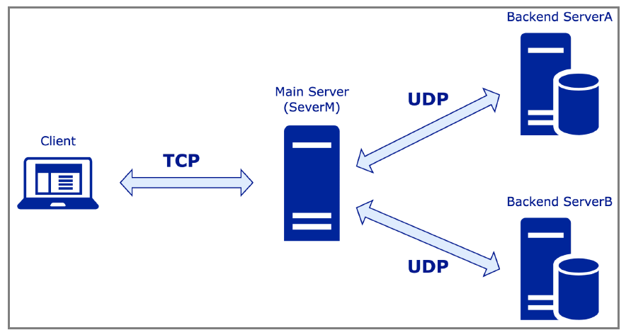

# Socket Programming
This project is implemented in C/C++ to build and develop 3 backend servers communicated by TCP and UDP, providing efficient and reliable data communication via socket programming. 

## Objective
- Build our system with Unix socket programming. 

- Set up two backend servers for the registration and processing of the available time for each individual. Server A processes a.txt to register the available time for each person. Server B processes b.txt.

- Set up a primary server for TCP communication with the client and UDP communication with the two backend servers.

- Establish a streamlined and dependable meeting scheduler system.

## Description
### Illustration of the system
<p align="center">
   
</p>


## How to use
1. Clone this repository to a 64-bit Ubuntu 16.04(Linux environment)

```bash
git clone https://github.com/JohnnyandLee/SocketProgramming
```

2. "make all" command in the terminal

3. "./serverM" command in a terminal

4. "./serverA" command in a different terminal

5. "./serverB" command in a different terminal

6. "./client" command in a different terminal

7. then follow the prompt for the client terminal to play this program
